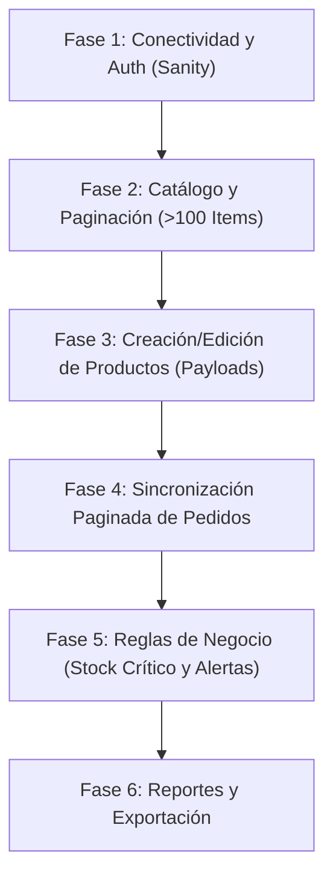

# Plan de Pruebas de Integración y Aseguramiento de Calidad: Módulo Cencosud

Este documento define el plan de pruebas estructurado para validar la integración del módulo **Cencosud Chile**, garantizando la estabilidad del sistema, el manejo de paginación, la resiliencia en payloads y el cumplimiento de las reglas de negocio.

---

## 1. Priorización del Orden de Ejecución

Para garantizar la estabilidad en producción, las pruebas se ejecutan en el siguiente orden secuencial:

---

## 2. Matriz de Casos de Prueba (QA Matrix)

A continuación se detalla la matriz de pruebas técnicas verificadas en el módulo:

| ID | Área / Componente | Escenario de Prueba | Entrada / Datos de Prueba | Comportamiento Esperado | Tipo de Prueba | Estado / Implementación |
|---|---|---|---|---|---|---|
| **TC-01** | **Conectividad** | Validación de Credenciales correctas | Client ID y Client Secret válidos (Ripholia prueba o Real) | Devuelve un Token de Acceso con código HTTP 200 y se guarda la conexión cifrada. | Sanity Test | **[Verificado]** Funcional |
| **TC-02** | **Conectividad** | Validación de Credenciales incorrectas | Client ID o Secret alterados / URL base inválida | La API de Cencosud rechaza la petición con HTTP 401/403. Se captura el error y se muestra mensaje amigable. | Negative Test | **[Verificado]** Funcional |
| **TC-03** | **Sincronización** | **Descarga de Catálogo > 100 Productos** *(Paginación offset/cursor)* | Cuenta con 150 productos en Cencosud y `limit=100` por página | El sistema realiza iteraciones automáticas (pág 1 con 100 items y pág 2 con 50 items usando `nextCursor` u `offset`). Quedan 150 productos en la caché. | **Stress / Regression** | **[Verificado]** Paginación iterativa completa |
| **TC-04** | **Productos** | **Creación/Edición con Atributos Incompletos** *(Manejo de Fallbacks)* | JSON con atributos mínimos (`sku`, `title`, `price`) | El sistema aplica respaldos automáticos (*Genérica*, *Único*, *Estándar*) y notifica a la Campanita para evitar rechazo 400 Bad Request. | **Negative / Payload** | **[Verificado]** Resiliencia con Fallbacks |
| **TC-05** | **Productos** | **Creación/Edición de Producto con Atributos Obligatorios Completos** | SKU, Título, Precio + Marca, Descripción, Categoría, Imágenes, Peso y Dimensiones | Cencosud procesa la creación con éxito (HTTP 200 / 201). | Functional | **[Verificado]** Validado con doc Cencosud |
| **TC-06** | **Pedidos** | **Sincronización Paginada de Pedidos** | 75 pedidos pendientes en Cencosud con paginación de 25 por llamada | El sincronizador de órdenes recorre las páginas (`page=1`, `page=2`, `page=3`) y procesa los 75 pedidos sin omitir registros. | **Regression** | **[Verificado]** Paginación por `page` iterativa |
| **TC-07** | **Negocio** | **Regla de Quiebre de Stock Crítico (1 a 5 unidades)** | Replicar o sincronizar un producto con 3 unidades en bodega física | Envía petición de actualización a Cencosud con stock = `0`. Se crea alerta tipo `low_stock` o `stock_warning` en la Campanita en español. | Functional | **[Verificado]** Implementado |
| **TC-08** | **Negocio** | **Sincronización de Stock Normal (> 5 unidades)** | Replicar un producto con 8 unidades en bodega física | Envía actualización a Cencosud con stock = `8`. No se genera ninguna alerta ni warning. | Functional | **[Verificado]** Implementado |
| **TC-09** | **UI / Reportes** | **Búsqueda Avanzada de Variantes por SKU** | Buscar SKU base `A-201` | Muestra agrupadas las variantes: Unidad (`A-201-ROJ-S`), Pack (`PACK-A-201...`) y Tripack (`TRIPACK-A-201...`). | Search Validation | **[Verificado]** Optimizado con REGEXP |
| **TC-10** | **UI / Reportes** | **Exportación a Excel de Auditoría** | Generar reporte XLSX de tienda | Descarga un `.xlsx` estilizado con fecha de generación, marcas de productos, y discrepancias/ofertas coloreadas condicionalmente. | Export Validation | **[Verificado]** Implementado |
| **TC-11** | **Negocio / Seguridad** | **Protección de Precio Mínimo y Erróneo ($1 peso)** | Intentar actualizar un precio a $1 CLP o con descuento > 70% respecto al maestro | Cancela la actualización a Cencosud, muestra error de seguridad y marca la fila para revisión manual con alerta en la Campanita. | Security / Business | **[Verificado]** Bloqueo anti-SERNAC |

---

## 3. Escenarios de Pruebas de Regresión y Casos Límite (Edge Cases)

Para validar la resiliencia del sistema ante escenarios límite en producción, se realizan los siguientes casos de prueba dirigidos:

### Escenario A: Prueba de Catálogo Voluminoso (> 100 Productos)
1. **Acción:** En la cuenta o simulador de Cencosud, configurar un catálogo de **120 productos**.
2. **Ejecución:** Ejecutar la sincronización de catálogo con el límite por página fijado en `limit=50`.
3. **Resultado esperado:** El proceso recorre automáticamente todas las páginas mediante el parámetro de offset/cursor hasta procesar los 120 productos.
4. **Verificación:** Ejecutar la consulta `SELECT COUNT(*) FROM cencosud_products_cache` y verificar que el resultado coincida exactamente con 120.

### Escenario B: Prueba de Creación / Validación de Payloads Exigidos por la API
1. **Acción:** La API oficial de Cencosud exige los campos obligatorios: `Brand`, `Description`, `CategoryId`, `Images` y `Dimensions` (`peso_kg`, `alto_cm`, `ancho_cm`, `grueso_cm`).
2. **Ejecución:** Enviar un producto con datos parciales desde el Creador de Productos o vía API.
3. **Resultado esperado:** El servicio enriquece automáticamente los campos con los datos del Maestro (`products_master`) y la tabla de medidas (`product_medidas`), aplicando respaldos nulos en caso de faltantes.
4. **Verificación:** Revisar el log del sistema y constatar la aprobación de la ficha sin rechazos `400 Bad Request`.

### Escenario C: Prueba de Procesamiento Completo de Órdenes Pendientes
1. **Acción:** Simular en el entorno un volumen de **60 pedidos pendientes** en un rango de fechas.
2. **Ejecución:** Correr el script o servicio de sincronización de órdenes (`syncOrders`) donde el límite por llamada a la API es de 20 pedidos.
3. **Resultado esperado:** El sincronizador recorre iterativamente la paginación (`page=1`, `page=2`, `page=3`) e ingresa los 60 pedidos en `cencosud_orders_cache`.
4. **Verificación:** Contar los registros en la tabla `cencosud_orders_cache` y corroborar que el número coincida exactamente con el total reportado por la API.

---

> [!IMPORTANT]
> **Recomendación de Operación:** 
> Antes de desplegar actualizaciones mayores, realizar un respaldo de la base de datos y utilizar el script CLI `cencosud_sync_products.php` para auditar la sincronización sin depender de la interfaz web.

